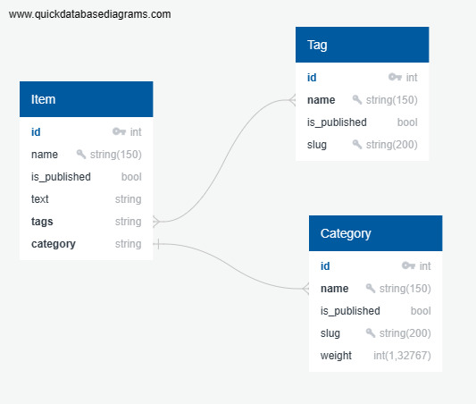

# Домашний проект на Django

## Описание

Учебный проект реализующий онлайн-магазин


### Инструкция по развертыванию проекта

- Склонируйте репозиторий проекта

```bash
git clone git@gitlab.crja72.ru:django_2023/students/214610-the-pimp-course-967.git
cd 214610-the-pimp-course-967
```

- Создание и активация виртуального окружения

```bash
python3 -m venv venv
source venv/bin/activate
```

- Создайте файл .env в корневой директории проекта

```bash
cd lyceum
touch .env
```

- Создайте переменные окружения в файле .env

```text
DJANGO_SECRET_KEY="secret"
DJANGO_DEBUG=True
DJANGO_ALLOWED_HOSTS=127.0.0.1,localhost
DJANGO_ALLOW_REVERSE=True
DJANGO_MAIL=example@mail.com
```

- Пример файла с переменными окружения .env.example

## Запуск проекта

### В prod режиме

- Установите зависимости из файла requirements/prod.txt

```bash
pip install -r requirements/prod.txt
```

### В dev режиме

- Установите зависимости из файла requirements/dev.txt

```bash
pip install -r requirements/dev.txt
```

### Установка БД

- Установите фикстуры из папки fixtures

```bash
python3 manage.py loaddata fixtures/data.json
```

- При внесении изменений в модели приложения, выполните миграцию БД

```bash
python3 manage.py migrate
```

- Создание суперпользователя

```bash
python manage.py createsuperuser
```

### Запуск сервера

- Выполните команду:

```bash
python3 manage.py runserver
```

## Общие данные

- Структура БД используемая в проекте отражена в файле ER.jpg
- 

## Создание переводов

- Добавьте при необходимости собственный перевод используя 'msgid' и 'msgstr'
- Скомпилируйте полученные файлы:

```bash
django-admin compilemessages
```
