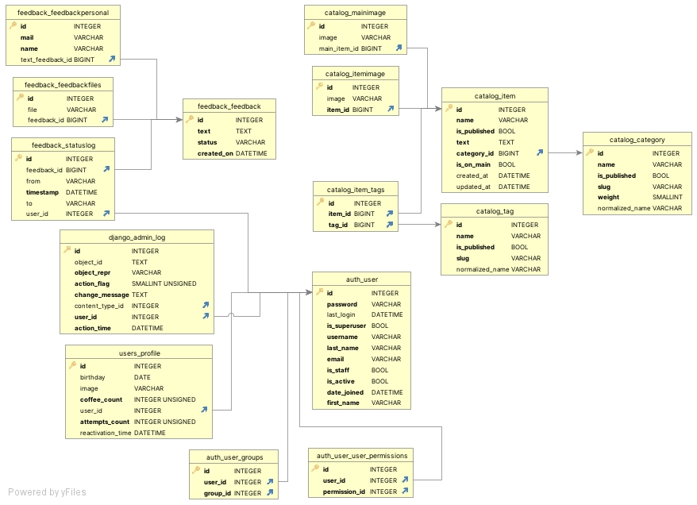

# Домашний проект на Django
### Описание
Учебный проект реализующий онлайн-магазин

### Инструкция по развертыванию проекта 
- Склонируйте репозиторий проекта
```bash
git clone git@gitlab.crja72.ru:django_2023/students/214610-the-pimp-47535.git
cd 214610-the-pimp-47535
```
- Создание и активация виртуального окружения
```
python3 -m pip install venv  
python3 -m venv venv
source venv/bin/activate
```
- Создайте файл .env в корневой директории проекта
```
cd lyceum
touch .env
```
- Создайте переменные окружения в файле .env
```
DJANGO_SECRET_KEY="secret"
DJANGO_DEBUG=True
DJANGO_ALLOWED_HOSTS=127.0.0.1,localhost
DJANGO_ALLOW_REVERSE=True
```
## Запуск проекта
### В prod режиме:
- Установите зависимости из файла requirements/prod.txt
```
pip install -r requirements/prod.txt
```
### В dev режиме:
- Установите зависимости из файла requirements/dev.txt
```
pip install -r requirements/dev.txt
``` 
### Установка БД:
- Установите фикстуры из папки fixtures
```
python3 manage.py loaddata fixtures/data.json
```
- При внесении изменений в модели приложения, выполните миграцию БД
```
python3 manage.py makemigrations
python3 manage.py migrate
```
- Создание суперпользователя
```
python manage.py createsuperuser
```
### Запуск сервера
- Выполните команду:
```
python3 manage.py runserver
```
# Общие данные
- Структура БД используемая в проекте отражена в файле ER.jpg 
- 
# Создание переводов
- Выполните команду для создания папки locale и базовых файлов перевода:
```
django-admin makemessages -a
```
- Добавьте при необходимости собственный перевод используя 'msgid' и 'msgstr'
- Скомпилируйте полученные файлы:
```
django-admin compilemessages
```